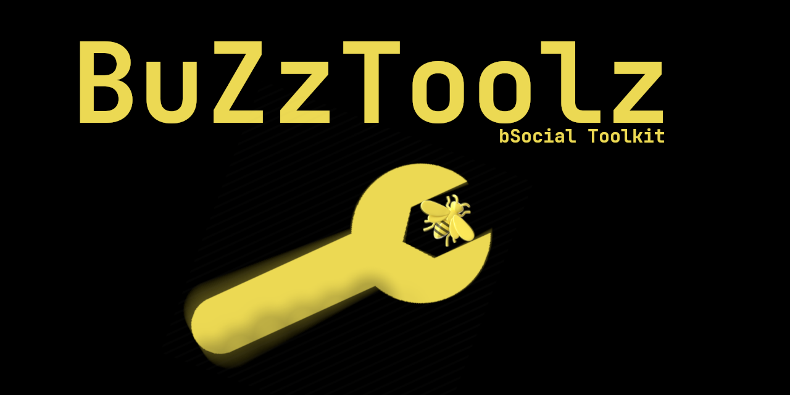

# BuZzToolz

This toolkit adds an optional download button to bSocial videos.  
It also adds an optional midnight theme to bSocial.

## Showcase
What the showcase video here: [Showcase Video](https://bsocial.buzz/watch/buzztoolz_Y6Me6Q9GHSPykfk.html)

## Install
- You can find the extension here: [addons.mozilla.org/en-US/firefox/addon/buzztoolz](https://addons.mozilla.org/en-US/firefox/addon/buzztoolz/)

## Info

This is BuZzToolz a completely free and open source firefox extension, as per GPL-3.0  
This is only a firefox extension, although I do plan on making a chrome version in the future.  
